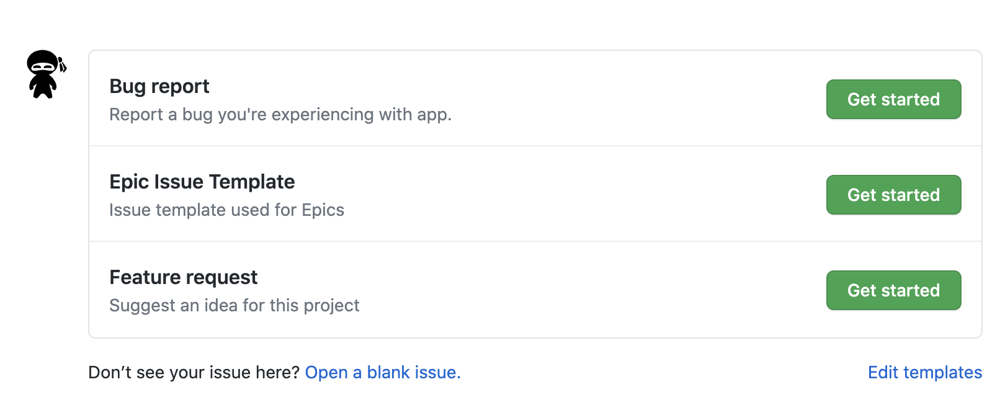

# The .github folder and it's functionality

### What is the .github folder?

The `.github` folder allows users to store GitHub related files/folders. Some of these files and folders perform special functions for organizing your repo, issues, and PRs.

Here are some of those functions:

- Creating issue templates ([ISSUE_TEMPLATE folder](../.github/ISSUE_TEMPLATE))
- Creating PR templates
- Creating a Code of Conduct
- Settings/config files for GitHub Actions
- Security (reporting security vulnerabilities)
- Code Owners (set default PR reviewers)

Here is how the `.github` folder looks in this repo.


### How to create an issue template

Creating issue templates allows you to save time when creating issues. They are also beneficial for making sure assignees are including adequate information in the PR. In order to create an issue template, you must

1. Make sure you have a `.github` folder in your project's root directory
2. Create a `ISSUE_TEMPLATE` folder in your `.github` folder
3. Create a `.md` file in the `ISSUE_TEMPLATE` folder
4. Add the following to the top of the file (change out this info with your own):

```
---
name: Bug report
about: Create a report to help us improve
title: ''
labels: bug
assignees: ''

---
```

> _this is important because it lets GitHub know what kind of issue template you are creating_

5. Use markdown to create the headers and body of the issue template. Such as the following: [Issue template](../.github/ISSUE_TEMPLATE/bug_report.md)

The end result should look something like this:


### How to create a PR template

Creating a PR template is identical to create an issue template. The only difference is that you must create the `.md` file in the root of the `.github` folder. You also do not need to complete step 4 of the Issue template process.

### How to create a code ownership file

Creating a `CODEOWNERS` file is beneficial because it allows you to specify which users should be request for review on PR's by default. This is especially useful for projects that have a lot of contributors. Creating a `CODEOWNER` file can be created as followed:

1. Create a `CODEOWNERS` file in your `.github` folder (CODEOWNERS file will have no file extension)
2. Add a `*` on the first line, and add an `@` sign followed by the GitHub usernames of the Code Owners.

ie. `* @username1 @username2 @username3`

---

You can find out more about the `.github` folder in the [GitHub documentation](https://docs.github.com/en).

Here are some docs for the additional functionalities of the `.github` folder mentioned at the start of this document:

- [Code of Conduct Docs](https://docs.github.com/en/communities/setting-up-your-project-for-healthy-contributions/adding-a-code-of-conduct-to-your-project)
- [GitHub Actions Docs](https://docs.github.com/en/actions/learn-github-actions/understanding-github-actions#create-an-example-workflow)
- [Security Policy Docs](https://docs.github.com/en/code-security/getting-started/adding-a-security-policy-to-your-repository)
